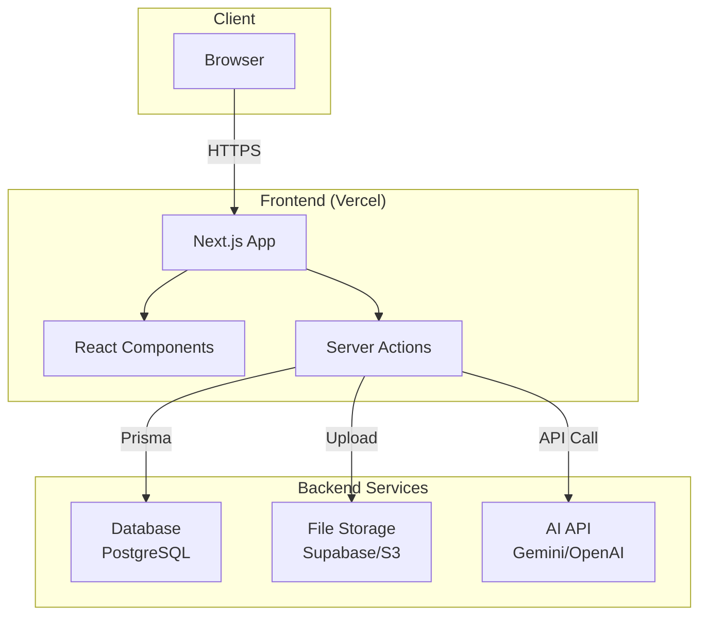
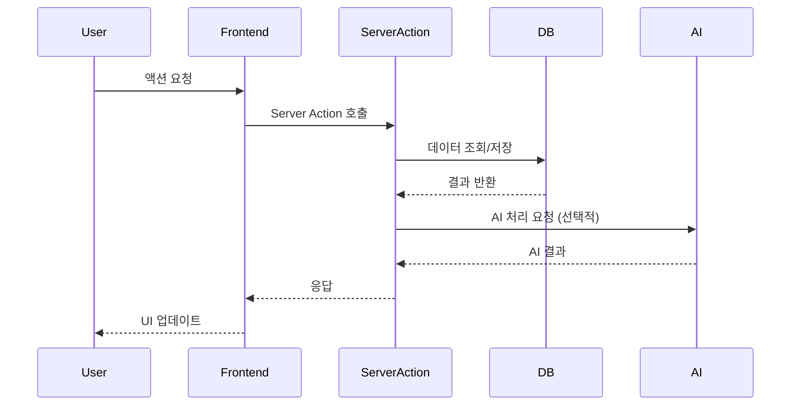
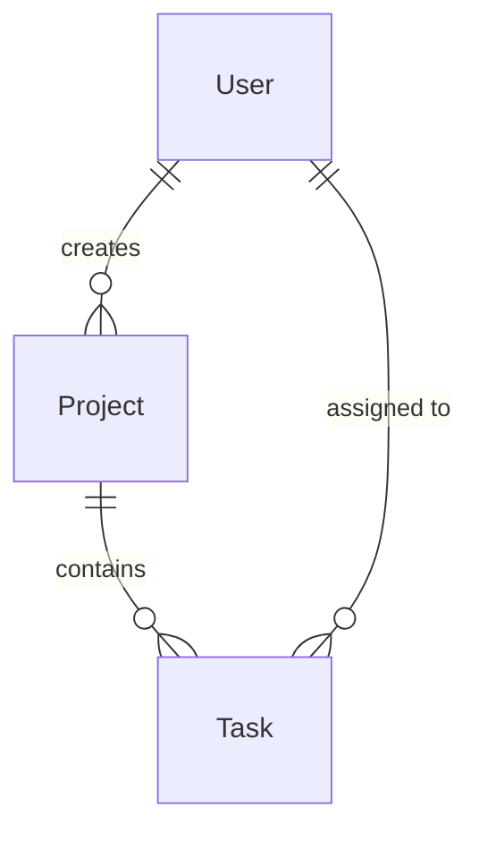
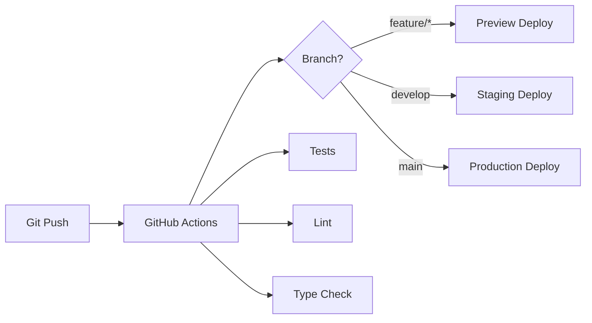

# [프로젝트명] - 기술 아키텍처

> **문서 버전**: 1.0  
> **마지막 업데이트**: YYYY-MM-DD  
> **작성자**: [이름]

---

## 📋 문서 개요

이 문서는 **[프로젝트명]**의 기술 스택, 아키텍처 구조, 개발 환경을 정의합니다.

**독자**: 개발자, AI Agent  
**목적**: 개발 시 기술적 의사결정의 기준점 제공

---

## 🏗️ Tech Stack

### Frontend
- **Framework**: [예: Next.js 15 (App Router)]
- **UI Library**: [예: React 19]
- **Styling**: [예: Tailwind CSS]
- **State Management**: [예: Zustand, React Query]
- **Form Handling**: [예: React Hook Form + Zod]
- **UI Components**: [예: shadcn/ui]

### Backend
- **Runtime**: [예: Node.js 20]
- **Framework**: [예: Next.js API Routes / Server Actions]
- **Authentication**: [예: NextAuth.js, Supabase Auth]
- **File Storage**: [예: Supabase Storage, AWS S3]

### Database
- **Database**: [예: PostgreSQL 15]
- **ORM**: [예: Prisma 5]
- **Hosting**: [예: Supabase, Railway]

### AI/ML
> 해당하는 경우에만 포함

- **AI Provider**: [예: Google Gemini, OpenAI]
- **Use Cases**: [예: 텍스트 생성, 이미지 분석]

### DevOps
- **Version Control**: Git + GitHub
- **CI/CD**: [예: GitHub Actions, Vercel]
- **Hosting**: [예: Vercel, Netlify]
- **Monitoring**: [예: Sentry, Vercel Analytics]

---

## 📁 프로젝트 구조

```
.
├── app/                      # Next.js App Router (또는 프레임워크별 구조)
│   ├── (auth)/               # 인증 관련 페이지
│   ├── (dashboard)/          # 대시보드 페이지
│   ├── api/                  # API Routes
│   ├── layout.tsx            # 루트 레이아웃
│   └── page.tsx              # 홈 페이지
│
├── components/               # React 컴포넌트
│   ├── ui/                   # 재사용 가능한 UI 컴포넌트
│   ├── features/             # 기능별 컴포넌트
│   └── layouts/              # 레이아웃 컴포넌트
│
├── lib/                      # 유틸리티 및 비즈니스 로직
│   ├── db/                   # 데이터베이스 관련
│   ├── auth/                 # 인증 관련
│   ├── utils/                # 유틸리티 함수
│   └── [feature]/            # 기능별 로직
│
├── types/                    # TypeScript 타입 정의
│   ├── index.ts              # 공통 타입
│   └── [feature].ts          # 기능별 타입
│
├── hooks/                    # 커스텀 React Hooks
│   └── use-[feature].ts
│
├── actions/                  # Server Actions (Next.js App Router)
│   └── [feature].ts
│
├── prisma/                   # Prisma 스키마 및 마이그레이션
│   ├── schema.prisma
│   └── migrations/
│
├── public/                   # 정적 파일
│   ├── images/
│   └── fonts/
│
├── docs/                     # 프로젝트 문서
│   ├── README.md
│   ├── PLAN.md
│   └── ...
│
├── .cursor/                  # Cursor IDE 규칙
│   └── rules/
│
├── AGENTS.md                 # AI Agent 전역 규칙
├── TODO.md                   # 작업 추적
├── .env.example              # 환경 변수 예시
├── .gitignore
├── package.json
└── README.md
```

---

## 🔄 아키텍처 다이어그램

### 시스템 아키텍처



### 데이터 흐름



---

## 🔐 인증 & 권한

### 인증 전략
- **Provider**: [예: NextAuth.js with Google OAuth]
- **Session**: [예: JWT, Database Session]
- **Strategy**: [예: OAuth 2.0, Magic Link]

### 권한 관리
```typescript
// 예시 - 실제 프로젝트에 맞게 수정
enum Role {
  USER = "USER",
  ADMIN = "ADMIN"
}

// 권한 체크 미들웨어
function requireAuth(role?: Role) {
  // 구현
}
```

---

## 💾 데이터베이스 설계

> 자세한 내용은 [DATABASE_SCHEMA.md](./DATABASE_SCHEMA.md) 참조

### 주요 엔티티
- **User**: 사용자 정보
- **[Entity 2]**: [설명]
- **[Entity 3]**: [설명]

### 관계


---

## 🔌 API 설계

> 자세한 내용은 [API_SPEC.md](./API_SPEC.md) 참조

### Server Actions (Next.js App Router 사용 시)
```typescript
// 예시
"use server"

export async function createProject(data: CreateProjectInput) {
  // 구현
}

export async function getProjects(userId: string) {
  // 구현
}
```

### REST API (별도 API 서버 사용 시)
- `GET /api/users/:id` - 사용자 조회
- `POST /api/projects` - 프로젝트 생성
- `PUT /api/projects/:id` - 프로젝트 수정
- `DELETE /api/projects/:id` - 프로젝트 삭제

---

## 🎨 디자인 시스템

### 컬러 팔레트
```css
:root {
  --primary: [색상 코드];
  --secondary: [색상 코드];
  --accent: [색상 코드];
  --background: [색상 코드];
  --foreground: [색상 코드];
}
```

### 타이포그래피
- **Heading**: [폰트명] [크기]
- **Body**: [폰트명] [크기]
- **Mono**: [폰트명] [크기]

### 컴포넌트 라이브러리
- [예: shadcn/ui - Button, Input, Dialog 등]
- 커스텀 컴포넌트는 `components/ui/` 에 위치

---

## 🛠️ 개발 환경

### 필수 요구사항
- Node.js: >= 20.x
- pnpm: >= 8.x (또는 npm, yarn)
- PostgreSQL: >= 15.x (로컬 개발 시)

### 환경 변수
```bash
# .env.example 참조
DATABASE_URL="postgresql://..."
NEXTAUTH_SECRET="..."
GOOGLE_CLIENT_ID="..."
GOOGLE_CLIENT_SECRET="..."
# ... 기타 환경 변수
```

### 개발 명령어
```bash
# 의존성 설치
pnpm install

# 개발 서버 실행
pnpm dev

# 프로덕션 빌드
pnpm build

# 타입 체크
pnpm type-check

# 린트
pnpm lint

# 테스트
pnpm test
```

### 데이터베이스 명령어
```bash
# Prisma 마이그레이션 생성
pnpm db:migrate

# Prisma Studio 열기
pnpm db:studio

# 데이터베이스 시드
pnpm db:seed
```

---

## 🧪 테스트 전략

### 단위 테스트
- **Framework**: [예: Jest, Vitest]
- **Coverage Target**: [예: 80%]

### E2E 테스트
- **Framework**: [예: Playwright, Cypress]
- **주요 시나리오**: [예: 로그인 플로우, 프로젝트 생성]

---

## 📦 배포 전략

### 배포 환경
- **Development**: [예: Vercel Preview]
- **Staging**: [예: Vercel Production (staging branch)]
- **Production**: [예: Vercel Production (main branch)]

### CI/CD 파이프라인


---

## 🔍 모니터링 & 로깅

### 에러 트래킹
- **Tool**: [예: Sentry]
- **Coverage**: Frontend + Backend

### 성능 모니터링
- **Tool**: [예: Vercel Analytics, Google Analytics]
- **Metrics**: [예: Core Web Vitals, API Response Time]

### 로깅
- **Development**: console.log
- **Production**: [예: Winston, Pino]

---

## ⚡ 성능 최적화

### Frontend
- [ ] 이미지 최적화 (Next.js Image)
- [ ] 코드 스플리팅 (Dynamic Import)
- [ ] 캐싱 전략 (React Query)
- [ ] Lazy Loading

### Backend
- [ ] 데이터베이스 인덱싱
- [ ] 쿼리 최적화
- [ ] API Response 캐싱
- [ ] Rate Limiting

---

## 🔒 보안 고려사항

### 주요 보안 원칙
- [ ] 환경 변수로 시크릿 관리 (`.env` 파일은 `.gitignore`)
- [ ] 모든 입력 검증 (Zod)
- [ ] SQL Injection 방지 (Prisma ORM 사용)
- [ ] XSS 방지 (React 자동 이스케이핑)
- [ ] CSRF 보호 (NextAuth.js 내장)
- [ ] Rate Limiting (API 엔드포인트)
- [ ] HTTPS Only (프로덕션)

---

## 📚 참고 자료

- [DATABASE_SCHEMA.md](./DATABASE_SCHEMA.md) - DB 스키마 상세
- [API_SPEC.md](./API_SPEC.md) - API 명세 상세
- [TERMINOLOGY.md](./TERMINOLOGY.md) - 용어 사전

---

## 📝 변경 이력

| 날짜 | 버전 | 변경 내용 | 작성자 |
|------|------|----------|--------|
| YYYY-MM-DD | 1.0 | 최초 작성 | [이름] |
