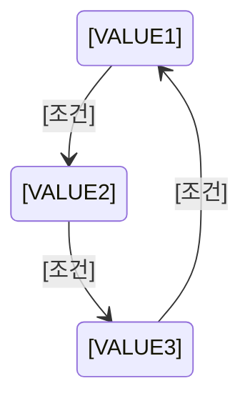
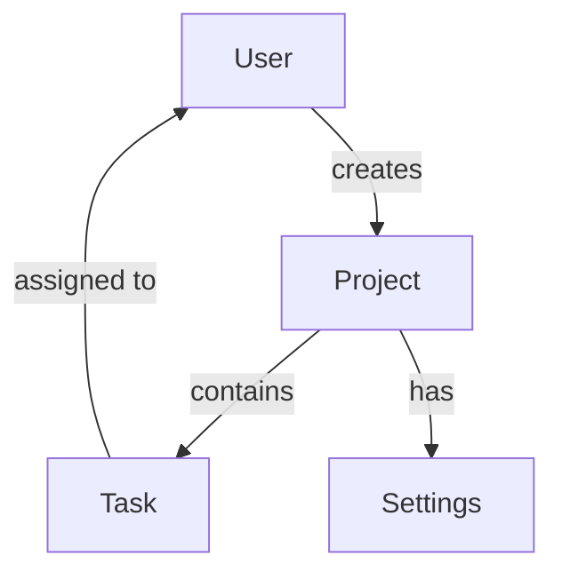

# [프로젝트명] - 표준 용어 사전

> **문서 버전**: 1.0  
> **마지막 업데이트**: YYYY-MM-DD  
> **작성자**: [이름]

---

## 📋 문서 개요

이 문서는 **[프로젝트명]** 프로젝트에서 사용하는 모든 용어를 정의합니다.

**독자**: 팀 전체, AI Agent  
**목적**: 프로젝트 전체에서 일관된 용어 사용 보장

**중요**: 새로운 개념이나 엔티티를 추가할 때는 **반드시** 이 문서에 먼저 정의하세요.

---

## 🎯 용어 정의 원칙

### 작성 규칙
1. **명확성**: 모호하지 않게, 구체적으로 정의
2. **일관성**: 한 용어는 하나의 의미만 가짐
3. **코드 연결**: 코드에서 어떻게 표현되는지 명시 (타입명, 테이블명, 컴포넌트명 등)
4. **예시 포함**: 실제 사용 예시 포함

### 용어 분류
- **도메인 용어**: 비즈니스 로직 관련 개념
- **기술 용어**: 기술 스택 관련 용어
- **UI/UX 용어**: 사용자 인터페이스 관련 용어

---

## 📚 도메인 용어

### [용어 1]
**정의**: [이 용어가 무엇을 의미하는지 명확히 정의]

**코드 표현**:
- **TypeScript 타입**: `[TypeName]`
- **데이터베이스**: `[table_name]` 테이블
- **API**: `/api/[endpoint]`

**속성**:
- `[property1]`: [설명]
- `[property2]`: [설명]

**예시**:
```typescript
// 예시 코드
const example: TypeName = {
  property1: "value",
  property2: 123
}
```

**관련 용어**: [관련된 다른 용어들]

---

### [용어 2]
**정의**: [정의]

**코드 표현**:
- **TypeScript 타입**: `[TypeName]`
- **데이터베이스**: `[table_name]` 테이블

**예시**:
```typescript
// 예시
```

---

## 🔀 헷갈리기 쉬운 용어 구분

### [용어 A] vs [용어 B]
- **[용어 A]**: [언제, 어떤 맥락에서 사용]
- **[용어 B]**: [언제, 어떤 맥락에서 사용]

**예시**:
```
✅ 올바른 사용: [예시]
❌ 잘못된 사용: [예시]
```

---

## 💻 기술 용어

### Server Action
**정의**: Next.js App Router에서 서버 사이드 로직을 실행하는 함수

**코드 표현**:
- **위치**: `actions/[feature].ts`
- **Prefix**: `"use server"` directive 사용

**예시**:
```typescript
"use server"

export async function createProject(data: CreateProjectInput) {
  // 서버 사이드 로직
}
```

---

### [기술 용어 2]
**정의**: [정의]

**사용 위치**: [어디서 사용되는지]

**예시**:
```typescript
// 예시
```

---

## 🎨 UI/UX 용어

### [UI 요소 1]
**정의**: [이 UI 요소가 무엇인지]

**코드 표현**:
- **컴포넌트**: `[ComponentName]`
- **위치**: `components/[path]/[component-name].tsx`

**사용 시나리오**: [언제, 어디서 사용되는지]

**예시**:
```tsx
<ComponentName
  prop1="value"
  prop2={123}
/>
```

---

## 📊 상태 및 액션

### 상태: [상태명]
**정의**: [이 상태가 의미하는 것]

**가능한 값**:
- `[VALUE1]`: [설명]
- `[VALUE2]`: [설명]
- `[VALUE3]`: [설명]

**상태 전이**:


**코드 표현**:
```typescript
enum [StateName] {
  VALUE1 = "VALUE1",
  VALUE2 = "VALUE2",
  VALUE3 = "VALUE3"
}
```

---

### 액션: [액션명]
**정의**: [이 액션이 무엇을 하는지]

**트리거**: [언제 발생하는지]

**결과**: [이 액션의 결과]

**코드 표현**:
```typescript
async function [actionName](params: Params): Promise<Result> {
  // 구현
}
```

---

## 🔢 데이터 타입 및 포맷

### [타입명]
**정의**: [이 타입이 무엇을 나타내는지]

**포맷**: [데이터 형식]

**예시**:
```
유효한 값: [예시]
잘못된 값: [예시]
```

**검증 규칙**:
```typescript
const [typeName]Schema = z.object({
  // Zod 스키마
})
```

---

## 📝 네이밍 컨벤션

### 파일명
- **컴포넌트**: `kebab-case.tsx` (예: `user-profile.tsx`)
- **Server Actions**: `kebab-case.ts` (예: `create-project.ts`)
- **유틸리티**: `kebab-case.ts` (예: `format-date.ts`)
- **타입**: `kebab-case.ts` (예: `user-types.ts`)

### 코드 네이밍
- **TypeScript 타입/인터페이스**: `PascalCase` (예: `UserProfile`)
- **함수**: `camelCase` (예: `createProject`)
- **상수**: `UPPER_SNAKE_CASE` (예: `MAX_FILE_SIZE`)
- **컴포넌트**: `PascalCase` (예: `UserProfile`)

### 데이터베이스
- **테이블명**: `PascalCase` (예: `UserProfile`)
- **컬럼명**: `camelCase` (예: `createdAt`)
- **관계명**: 복수형 사용 (예: `users`, `projects`)

---

## 🔗 용어 관계도



---

## 📖 용어 색인 (알파벳 순)

| 용어 | 정의 | 섹션 |
|------|------|------|
| [용어 A] | [간단한 정의] | [도메인 용어](#도메인-용어) |
| [용어 B] | [간단한 정의] | [기술 용어](#기술-용어) |
| [용어 C] | [간단한 정의] | [UI/UX 용어](#uiux-용어) |

---

## ✅ 용어 추가 체크리스트

새로운 용어를 추가할 때 확인:

- [ ] 명확한 정의 작성
- [ ] 코드 표현 명시 (타입명, 테이블명 등)
- [ ] 실제 사용 예시 포함
- [ ] 관련 용어와의 관계 설명
- [ ] 헷갈릴 수 있는 용어와 구분
- [ ] 용어 색인에 추가
- [ ] 관련 문서(PLAN.md, DATABASE_SCHEMA.md 등)와 일관성 확인

---

## 📚 참고 자료

- [PLAN.md](./PLAN.md) - 비즈니스 용어 맥락
- [DATABASE_SCHEMA.md](./DATABASE_SCHEMA.md) - 데이터베이스 엔티티
- [API_SPEC.md](./API_SPEC.md) - API 관련 용어

---

## 📝 변경 이력

| 날짜 | 버전 | 변경 내용 | 작성자 |
|------|------|----------|--------|
| YYYY-MM-DD | 1.0 | 최초 작성 | [이름] |
